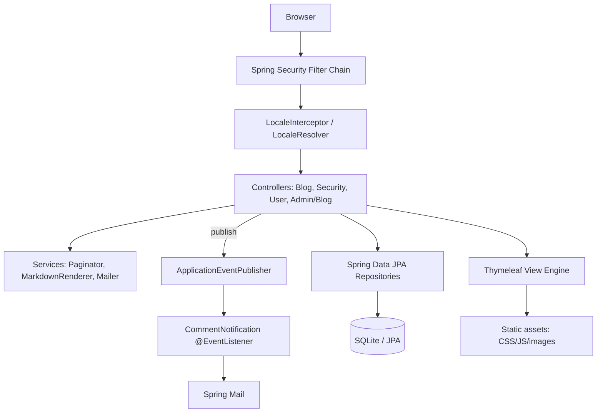

# Design: Symfony Demo PHP-to-Java Migration

## Overview

This design describes migrating the Symfony Demo blog application from PHP/Symfony 8 to
Java 21 + Spring Boot 3.2+, preserving behavioral parity. It is a **structure-preserving,
big-bang** migration: Java packages mirror the PHP `App\` namespace, URL paths and HTTP
semantics are preserved exactly, and a parity harness is built before translation to act as
the objective referee.

### Key design decisions

1. **Preserve URL structure and HTTP semantics** — `#[Route]` paths map 1:1 to Spring MVC
   mappings (`/blog/`, `/blog/posts/{slug}`, `/login`, `/profile/edit`, admin routes).
2. **Doctrine → Spring Data JPA** — attribute-mapped entities become JPA `@Entity` classes;
   repositories become Spring Data interfaces with custom queries where Doctrine had them.
3. **Twig → Thymeleaf** — templates re-authored to produce equivalent DOM for the same model.
4. **Symfony Security → Spring Security** — form login, remember-me, role hierarchy, and the
   `PostVoter` map to Spring Security form login + method/expression authorization.
5. **Events → Spring events** — `CommentCreatedEvent` + subscriber becomes
   `ApplicationEventPublisher` + `@EventListener` (email side-effect preserved).
6. **Schema unchanged** — same `symfony_demo_*` tables via Flyway; SQLite for parity.
7. **Parity-first** — Phase 1 builds the judge (harness) against the running PHP baseline.

## Architecture



### Request flow
1. Spring Security filter chain handles authentication/authorization.
2. A locale interceptor resolves the active locale (parity with the locale subscriber).
3. The controller handles the route, delegating to repositories/services.
4. Thymeleaf renders the response; events fire side-effects (email) asynchronously as in PHP.

## Components and Interfaces

The application is organized into the components below (package layout mirrors the PHP `App\`
namespace). Controllers handle HTTP I/O; repositories provide data access; services hold
cross-cutting logic (pagination, markdown, mail); security components enforce authn/authz;
events decouple side-effects.

### Package structure (mirrors `App\`)

```
target-java/
├── pom.xml
├── src/main/java/com/symfony/demo/
│   ├── DemoApplication.java
│   ├── config/                  # SecurityConfig, WebMvcConfig, LocaleConfig, MailConfig, properties
│   ├── controller/              # BlogController, SecurityController, UserController, admin/BlogController
│   ├── entity/                  # User, Post, Comment, Tag
│   ├── repository/              # UserRepository, PostRepository, TagRepository, CommentRepository
│   ├── form/                    # DTOs: PostDto, CommentDto, UserDto, ChangePasswordDto (+ validation)
│   ├── security/                # PostPermissionEvaluator (PostVoter parity), UserDetails adapter
│   ├── event/                   # CommentCreatedEvent + listener
│   ├── service/                 # Paginator, MarkdownRenderer, UserService
│   ├── command/                 # AddUser, DeleteUser, ListUsers (CommandLineRunner/Picocli)
│   └── i18n/                    # MessageSource config, locale redirect
├── src/main/resources/
│   ├── application.yml
│   ├── db/migration/            # Flyway: V1__schema.sql, V2__seed.sql (fixtures parity)
│   ├── templates/               # Thymeleaf (blog/, security/, user/, admin/, _partials)
│   ├── i18n/messages_*.properties
│   └── static/                  # compiled CSS/JS/images
└── src/test/java/com/symfony/demo/
    ├── property/                # jqwik property tests (validation, paginator, voter, markdown)
    ├── integration/             # Spring Boot MVC + JPA tests
    └── parity/                  # PHP-vs-Java parity harness
```

## Data Models

| PHP (Doctrine) | Java (JPA) | Notes |
|---|---|---|
| `#[ORM\Entity]` + `#[ORM\Table]` | `@Entity @Table(name=...)` | keep `symfony_demo_*` names |
| `#[ORM\Id] #[ORM\GeneratedValue]` | `@Id @GeneratedValue(IDENTITY)` | — |
| `#[ORM\Column(type: STRING/TEXT/INTEGER)]` | `@Column` (String/`@Lob`/Integer) | — |
| `#[ORM\Column(type: JSON)]` roles | `@Convert` list-to-JSON or element collection | preserve default `ROLE_USER` |
| `#[ORM\ManyToOne]` author | `@ManyToOne` | `nullable=false` where specified |
| `#[ORM\OneToMany] cascade persist, orphanRemoval` | `@OneToMany(cascade=PERSIST, orphanRemoval=true)` + `@OrderBy` | comments DESC |
| `#[ORM\ManyToMany]` tags + JoinTable | `@ManyToMany` + `@JoinTable(symfony_demo_post_tag)` + `@OrderBy(name ASC)` | max 4 (validation) |
| `\DateTimeImmutable publishedAt` | `java.time.Instant`/`OffsetDateTime` | set on construct |
| `UserInterface`, roles default | Spring `UserDetails` adapter; `getRoles()` defaults to `ROLE_USER` | — |

Validation constraints (Jakarta Bean Validation) mirror the PHP `Assert\*` and `UniqueEntity`
rules (see Requirement 11).

## Routing map (Symfony → Spring MVC)

| Route | PHP | Spring |
|---|---|---|
| `GET /blog/`, `/blog/page/{page}` | `BlogController::index` | `@GetMapping` returns blog index view w/ paginator |
| `GET /blog/rss.xml` | same action, xml format | `@GetMapping(produces=APPLICATION_XML)` |
| `GET /blog/posts/{slug}` | `BlogController::postShow` | `@GetMapping`; 404 if missing |
| `POST /blog/comment/{postSlug}/new` | `BlogController::commentNew` (auth) | `@PostMapping` + `@PreAuthorize("isAuthenticated()")` |
| `GET /blog/search` | `BlogController::search` | `@GetMapping` |
| `GET /login` | `SecurityController::login` | Spring Security form login page |
| `/profile/edit`, `/profile/change-password` | `UserController` (`ROLE_USER`) | `@PreAuthorize("hasRole('USER')")` |
| Admin blog CRUD | `Admin\BlogController` (`ROLE_ADMIN`) | `@PreAuthorize("hasRole('ADMIN')")` |

## Security design

- **Authentication**: Spring Security form login on `/login`; `UserDetailsService` backed by
  `UserRepository`. Password encoder must match the seeded hash format (bcrypt/argon2 as used
  by the demo) so seeded users authenticate identically — documented in `BEHAVIOR_CHANGES.md`
  if the algorithm differs.
- **Authorization**: role hierarchy `ROLE_ADMIN > ROLE_USER`; a `PostPermissionEvaluator`
  (or `AuthorizationManager`) reproduces `PostVoter`: allow `edit`/`delete` iff current user is
  the post author or has `ROLE_ADMIN`.
- **CSRF**: enabled for state-changing forms (comment, profile, admin), matching Symfony's
  form CSRF tokens.
- **Change-password logout**: after a successful password change, the user is logged out
  (parity with the PHP `Security::logout`).

## Events, mail, i18n, markdown, pagination

- **Events**: `CommentCreatedEvent` published via `ApplicationEventPublisher`; an
  `@EventListener` (optionally `@Async`) sends the author-notification email via Spring Mail +
  a Thymeleaf email template.
- **i18n**: `MessageSource` loads `messages_*.properties` (converted from the PHP translations);
  a `LocaleResolver` + interceptor reproduces preferred-locale redirect.
- **Markdown**: `org.commonmark:commonmark` renders post content equivalently to
  `league/commonmark`; parity tests compare rendered HTML.
- **Pagination**: a `Paginator` service reproduces the PHP `Paginator` page size and metadata.

## Correctness Properties

*Validated via jqwik property-based tests.*

### Property 1: Post validation parity
For any post input, the accept/reject decision and the set of violated constraints match the PHP
rules (title/summary/content/tags). **Validates: Requirements 11.1**

### Property 2: User validation parity
For any user input, username length 2–50 + uniqueness and email validity/uniqueness are enforced
identically to the PHP app. **Validates: Requirements 11.1**

### Property 3: Roles default
`getRoles()` always contains `ROLE_USER` and returns a de-duplicated list, matching the PHP
entity. **Validates: Requirements 2.5**

### Property 4: PostVoter parity
For any (user, post), `edit`/`delete` is granted if and only if the user is the post author or has
`ROLE_ADMIN`. **Validates: Requirements 10.1**

### Property 5: Paginator invariant
For any total/pageSize/page, the page bounds and item slice match the PHP `Paginator`.
**Validates: Requirements 3.4**

### Property 6: Slug uniqueness
Creating a post with a duplicate slug surfaces the uniqueness error on the `title` field.
**Validates: Requirements 11.1**

### Property 7: Markdown round-trip
For representative Markdown inputs, the rendered HTML matches the CommonMark baseline
(structural compare). **Validates: Requirements 4.3**

## Parity harness (the judge)

- Docker Compose brings up the **PHP baseline** (Symfony Demo on SQLite, seeded via fixtures)
  and the **Java port**, seeded via Flyway with the same data.
- A base parity test issues identical requests to both and diffs: status code, redirect
  `Location` (path-normalized), and normalized body structure (strip CSRF tokens, session ids,
  timestamps; JSON/HTML-aware).
- Coverage: blog index/pagination/tag, RSS, post detail, comment add (authenticated), search,
  login/logout, profile edit, change password, admin CRUD, authorization (403 cases).
- The harness is validated against deliberately broken code before it is trusted.
- Environment-gated (skips cleanly when Docker/both stacks are unavailable), mirroring the DVWA
  project's approach.

## Error Handling

- **Not found**: an unknown post slug (`/blog/posts/{slug}`) yields HTTP 404, matching the PHP
  EntityValueResolver behavior. A `@ControllerAdvice` maps `EntityNotFoundException` / empty
  `Optional` lookups to 404 with the standard error page.
- **Validation failures**: form submissions that fail Jakarta Bean Validation re-render the
  originating form with field errors and do **not** persist (parity with Symfony form errors).
- **Authorization failures**: unauthorized admin/edit/delete attempts return HTTP 403 via Spring
  Security; unauthenticated access to protected routes redirects to `/login` (or 401 per baseline).
- **CSRF failures**: missing/invalid CSRF tokens on state-changing requests are rejected,
  matching Symfony form CSRF behavior.
- **Mail/side-effect failures**: the comment-notification listener isolates email failures so a
  mail error does not roll back the persisted comment (the PHP flow dispatches after flush).
- **Global fallback**: a `@ControllerAdvice` renders an equivalent error page for uncaught
  exceptions, avoiding leakage of stack traces in the prod profile.

## Testing Strategy

- **Property-based tests (jqwik)** validate the correctness properties above (validation parity,
  roles default, PostVoter, paginator invariant, markdown round-trip).
- **Integration tests (Spring Boot + MockMvc, Testcontainers where a real DB is needed)** cover
  end-to-end flows: blog browsing, authenticated commenting + event, login/logout, profile edit,
  change-password logout, and admin CRUD including 403 authorization cases.
- **Parity tests (the judge)** replay identical requests against the PHP baseline and the Java
  port and diff status, redirect target, and normalized body structure; validated against
  deliberately broken code before being trusted. Environment-gated to skip cleanly without Docker.
- **Definition of done**: unit/property/integration suites green and parity holds per flow (or
  every mismatch recorded as an accepted deviation in `BEHAVIOR_CHANGES.md`).

## PHP → Java mapping summary

| PHP / Symfony | Java / Spring | 
|---|---|
| `#[Route]` | `@GetMapping`/`@PostMapping` (exact paths) |
| Doctrine entity/repo | JPA `@Entity` + Spring Data repository |
| `#[MapEntity]` / EntityValueResolver | repository lookup in controller / `@ModelAttribute` |
| Twig | Thymeleaf |
| Symfony Forms + Validator | Spring form binding + Jakarta Bean Validation on DTOs |
| Symfony Security (form login, roles) | Spring Security form login + role hierarchy |
| `PostVoter` | `PostPermissionEvaluator` / `AuthorizationManager` |
| `#[CurrentUser]` | `@AuthenticationPrincipal` |
| `EventDispatcher` + subscriber | `ApplicationEventPublisher` + `@EventListener` |
| Mailer | Spring Mail + Thymeleaf email template |
| league/commonmark | commonmark-java |
| Console `Command` | `CommandLineRunner` / Picocli |
| translations (`*.yaml`/`*.xlf`) | `messages_*.properties` + `MessageSource` |
| `.env` | `application.yml` + `@ConfigurationProperties` |
| Doctrine fixtures | Flyway seed (`V2__seed.sql`) / dev seeder |
